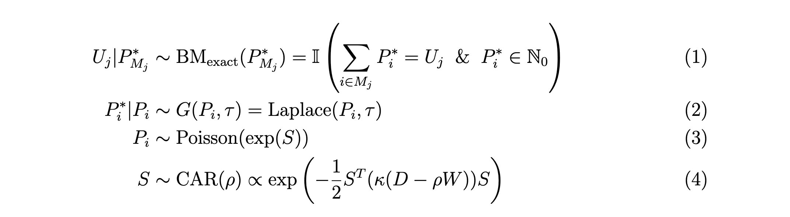

# Population Uncertainty from Census Differential Privacy

## Project Overview

This project addresses the challenge of population count uncertainty resulting from differential privacy (DP) mechanisms implemented by the U.S. Census Bureau. These mechanisms intentionally inject noise into published population counts to protect individual privacy, creating uncertainty especially at fine geographic scales. 

We develop hierarchical Bayesian models that leverage:
1. Spatial autocorrelation in population patterns
2. Known higher-level benchmark totals
3. The statistical properties of the noise-injection mechanism

## Models

We propose a bayesian hierarchical model to capture the uncertainty induced by  noise-injection and post-processing. The following is a model for exact benchmarking:

Equations (3) and (4) put a spatial prior on the unknown true population counts, will allow the model to leverage the spatial structure in population size/density to recover the latent true population counts. Equation (2) captures the DP noise injection into P_i from known distribution G. Finally, equation (1) encodes the application of the constraints in the DAS post-processing. We will embed the components of this formulation into the likelihood and prior for the disease mapping model.

The inexact benchmarking model uses the following benchmarking prior, with all of the other components as before: 

In this simulation, hyperparameters rho  and kappa were assigned uniform(0,1) and inverse-gamma(0.001, 0.001) priors respectively. 

## Simulation Study

### Data generation

`src/generate_data.r` - Data is generated according to the model specified above.

### One Model Run

`Simulation_study.rmd` - Has code to run a single model, creates visualizations, convergence checks, and model evaluation 

### Full Simulation

tbd, probably use cluster

## Integration into a full small area spatial analysis

For classical measurement error, Xia and Carlin (1998) showed that their bayesian approach to incorporating uncertainty into covariates corrects estimation and inference in spatial disease models. In disease count models, population counts are used as an "offset" which can be thought of as a log-transformed covariate whose coefficient is forced to be 1. We can use the above model to incorporate the error induced by DP procedures including post-processing into the larger spatial disease model. 

### Simulation example

- compare spatial model with and without "measurement error" component
- assess coverage, bias, and variance of model estimates

### Real Data example

- compare spatial model with and without "measurement error" component
